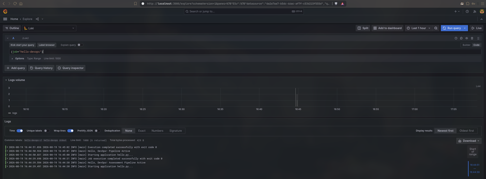
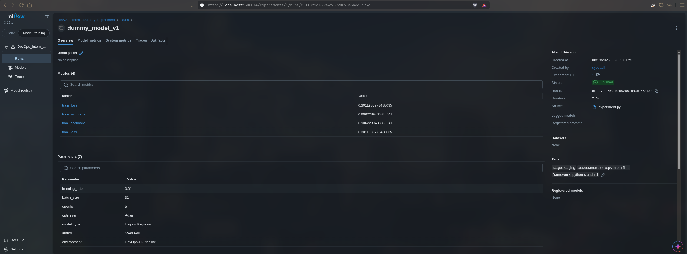

# DevOps Intern Final Assessment

[](https://github.com/syedadil02/devops-intern-final/actions/workflows/ci.yml)

**Author:** Syed Adil
**Date:** August 19, 2026

---

## Project Overview

This repository demonstrates an end-to-end DevOps workflow built with industry-standard open-source tools:
- **Linux Shell Scripting** (System monitoring and diagnostics)
- **Git & GitHub** (Version control and project management)
- **Docker** (Application containerization)
- **GitHub Actions** (Continuous Integration & Automated Testing)
- **HashiCorp Nomad** (Service orchestration and job scheduling)
- **Grafana Loki & Promtail** (Centralized log aggregation and monitoring)
- **MLflow Tracking** *(Extra Credit)* (Machine learning experiment tracking)

---

## Repository Structure

```text
devops-intern-final/
├── .github/
│   └── workflows/
│       └── ci.yml                 # GitHub Actions CI pipeline configuration
├── scripts/
│   └── sysinfo.sh                 # Linux system diagnostics bash script
├── nomad/
│   └── hello.nomad                # Nomad job specification (service type)
├── monitoring/
│   ├── loki_setup.txt             # Loki & Promtail setup guide & verification notes
│   ├── docker-compose.yml         # Full monitoring stack (Loki + Promtail + Grafana)
│   ├── loki-config.yml            # Loki server configuration
│   ├── promtail-config.yml        # Promtail log shipping configuration
│   └── grafana/
│       └── provisioning/
│           └── datasources/
│               └── datasources.yml # Auto-provisioned Loki data source for Grafana
├── mlflow/                        # [Extra Credit] Experiment tracking
│   ├── experiment.py              # Dummy experiment logging metrics/parameters
│   ├── requirements.txt           # MLflow dependencies
│   └── README.md                  # MLflow execution instructions
├── screenshots/                   # Verification screenshots
│   ├── grafana_logs.png           # Grafana Loki LogQL exploration screenshot
│   └── ML-Flow.png                # MLflow Experiment tracking dashboard screenshot
├── Dockerfile                     # Docker container definition for hello.py
├── hello.py                       # Core Python application
├── .gitignore                     # Git ignore rules
└── README.md                      # Complete project documentation
```

---

## Step-by-Step Implementation & Run Instructions

### Step 1: Git & Python Application Setup
The core application is a lightweight Python script [`hello.py`](file:///var/home/syedadil/devops-intern-final/hello.py) that outputs a greeting message.

**Run directly:**
```bash
python3 hello.py
```
*Expected Output:*
```text
Hello, DevOps!
```

---

### Step 2: Linux & Scripting Basics
A robust bash script [`scripts/sysinfo.sh`](file:///var/home/syedadil/devops-intern-final/scripts/sysinfo.sh) was created to display current user (`whoami`), system date (`date`), and disk utilization (`df -h`).

**Make executable & run:**
```bash
chmod +x scripts/sysinfo.sh
./scripts/sysinfo.sh
```

*Sample Output:*
```text
==========================================
          SYSTEM INFORMATION
==========================================

[1] Current User:
syedadil

[2] Current Date & Time:
Wed Aug 19 03:18:17 PM IST 2026

[3] Disk Usage (Human Readable):
Filesystem      Size  Used Avail Use% Mounted on
devtmpfs        7.6G     0  7.6G   0% /dev
/dev/nvme0n1p3  952G  571G  379G  61% /
...
```
---

### Step 3: Docker Basics & Containerization
The application is packaged into a minimal Docker container using [`Dockerfile`](file:///var/home/syedadil/devops-intern-final/Dockerfile) based on `python:3.11-slim`.

**1. Build the Docker image:**
```bash
docker build -t hello-devops:latest .
```

**2. Run the Docker container:**
```bash
docker run --rm hello-devops:latest
```

*Output:*
```text
Hello, DevOps!
```

---

### Step 4: CI/CD with GitHub Actions
A continuous integration pipeline is defined in [`.github/workflows/ci.yml`](file:///var/home/syedadil/devops-intern-final/.github/workflows/ci.yml).

**Workflow Triggers:**
- Automatic execution on every `push` and `pull_request` to `main`/`master` branches.

**Pipeline Steps:**
1. Check out repository code (`actions/checkout@v4`).
2. Set up Python environment (`actions/setup-python@v5`).
3. Execute `hello.py` and verify exit status.
4. Execute `scripts/sysinfo.sh` to validate shell scripts.
5. Build the Docker image `hello-devops:latest`.
6. Run the containerized image and confirm output.

The status badge is displayed at the top of this README.

---

### Step 5: Job Deployment with Nomad
The workload is orchestrated using HashiCorp Nomad with the job specification file [`nomad/hello.nomad`](file:///var/home/syedadil/devops-intern-final/nomad/hello.nomad).

**Job Characteristics:**
- **Type:** `service`
- **Driver:** `docker`
- **Allocated Resources:** Minimal footprint (`cpu = 100` MHz, `memory = 64` MB)
- **Restart Policy:** 3 attempts with exponential delay

**Deployment Instructions:**

1. **Start a local Nomad development agent (if not running):**
   ```bash
   nomad agent -dev
   ```

2. **Validate the job specification:**
   ```bash
   nomad job validate nomad/hello.nomad
   ```

3. **Plan the job deployment:**
   ```bash
   nomad job plan nomad/hello.nomad
   ```

4. **Run the job:**
   ```bash
   nomad job run nomad/hello.nomad
   ```

5. **Check job status and allocation logs:**
   ```bash
   nomad job status hello-devops
   nomad alloc logs <ALLOCATION_ID>
   ```

6. **Stop the job:**
   ```bash
   nomad job stop hello-devops
   ```

---

### Step 6: Monitoring with Grafana Loki & Promtail
Logs from containers and Nomad allocations are collected and forwarded to Grafana Loki. Detailed configuration notes are documented in [`monitoring/loki_setup.txt`](file:///var/home/syedadil/devops-intern-final/monitoring/loki_setup.txt).

**1. Launch the Monitoring Stack (Loki + Promtail + Grafana):**
```bash
cd monitoring
docker-compose up -d
```

**2. Verify Loki Status:**
```bash
curl -s http://localhost:3100/ready
# Output: ready
```

**3. Query Logs via cURL / LogQL:**
```bash
curl -G -s "http://localhost:3100/loki/api/v1/query_range" \
  --data-urlencode 'query={job="hello-devops"}' | jq .
```

**4. Query Logs via LogCLI:**
```bash
export LOKI_ADDR=http://localhost:3100
logcli query '{job="hello-devops"}'
```

**5. View in Grafana UI:**
- Open `http://localhost:3000` (User: `admin`, Password: `admin`).
- Go to **Explore** -> Select **Loki** data source.
- Run query: `{job="hello-devops"} |= "Hello, DevOps!"`.

#### Grafana Loki Log Explorer Screenshot


---

### Step 7: MLflow Experiment Tracking
An automated experiment tracking script is provided under [`mlflow/`](file:///var/home/syedadil/devops-intern-final/mlflow/).

**1. Install Dependencies:**
```bash
pip install -r mlflow/requirements.txt
```

**2. Run Dummy Training Experiment:**
```bash
python mlflow/experiment.py
```

**3. Open MLflow Dashboard:**
```bash
mlflow ui --port 5000
```
Navigate to [http://localhost:5000](http://localhost:5000) to inspect parameters (`learning_rate`, `batch_size`, `epochs`), multi-epoch loss/accuracy metrics, and generated artifacts.

#### MLflow Experiment Tracking Dashboard Screenshot


---
